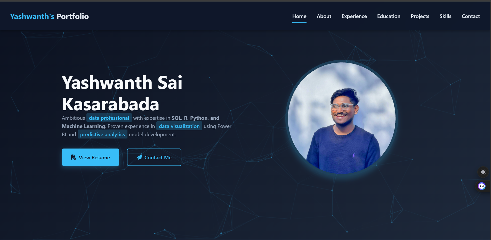

# Yashwanth Kasarabada - Personal Portfolio

 <!-- Replace with your actual screenshot URL -->

## 🚀 Features

- Modern, responsive design
- Interactive timeline for work experience
- Project showcase with technology tags
- Skills visualization with progress bars
- Contact form with validation

## 🛠️ Tech Stack

**Frontend:**
- HTML5 (Semantic structure)
- CSS3 (Flexbox, Grid, Animations)
- JavaScript (DOM manipulation)

**Libraries:**
- Font Awesome (Icons)
- Google Fonts (Inter font family)

## 📂 Project Structure
## 🔧 Installation & Setup

1. Clone the repository:

git clone https://github.com/yashhackz360/portfolio.git
cd portfolio

📝 License
MIT License - See LICENSE file for details.

📬 Contact
For any questions or feedback, please reach out:

Email: yashwanthsaikasarabada@gmail.com

LinkedIn: Yashwanth Kasarabada

GitHub: @yashhackz360

